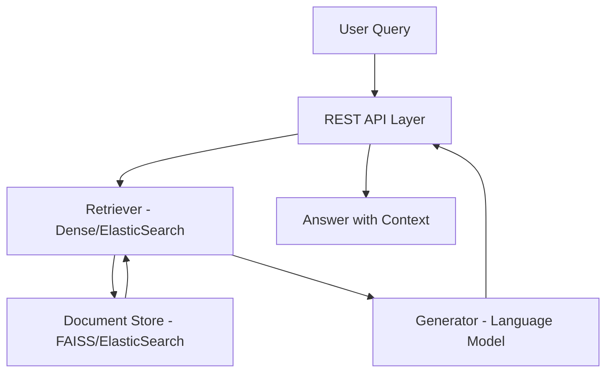

# Enhanced-Document-Q-A-System-using-RAG-Pipeline
# Enhanced Document Q&A System using RAG Pipeline

## Introduction

The Enhanced Document Q&A System using RAG Pipeline is an advanced solution for querying and extracting information from documents. By leveraging the Retrieval-Augmented Generation (RAG) architecture, this system efficiently combines document retrieval with generative language models. The result is accurate, context-aware answers to natural language questions based on a large corpus of documents.

## Usage

To use the Enhanced Document Q&A System, provide your document corpus, configure the retrieval backend, and start the server. Users can then send natural language queries and receive generated answers, supported by relevant document excerpts. Typical use cases include knowledge base search, document analytics, enterprise Q&A, and research support.

## Features

- RAG (Retrieval-Augmented Generation) pipeline for high-accuracy Q&A
- Integration with various document stores for scalable retrieval
- Modular retriever and generator components
- REST API for easy integration
- Support for diverse document types
- Context-aware answer generation
- Configurable parameters for retrieval and generation
- Logging and monitoring capabilities

## Requirements

- Python 3.8+
- PyTorch or TensorFlow (for deep learning models)
- Transformers (Hugging Face)
- FAISS or ElasticSearch (for retrieval)
- FastAPI or Flask (for API serving)
- Additional dependencies as specified in `requirements.txt`

## Configuration

Configuration is managed via environment variables and configuration files. Key parameters include:

- **Document Store Settings**: Backend type (FAISS, ElasticSearch), index path, connection details
- **Model Settings**: Generator and retriever model names/paths, device (CPU/GPU)
- **API Settings**: Host, port, authentication (if required)
- **Retrieval Parameters**: Top-K retrieval, chunk size, similarity metric
- **Logging**: Log level, log file path

Example configuration file:

```yaml
document_store:
  backend: faiss
  index_path: ./indices/documents.index

models:
  retriever: sentence-transformers/all-MiniLM-L6-v2
  generator: facebook/rag-token-base

api:
  host: 0.0.0.0
  port: 8080
  authentication: false

retrieval:
  top_k: 5

logging:
  level: INFO
  file: ./logs/system.log
```

## Contributing

We welcome contributions to enhance the system. To contribute:

- Fork the repository and clone your fork
- Create a feature branch (`git checkout -b feature/your-feature`)
- Commit your changes with clear messages
- Ensure tests pass and add new tests if needed
- Submit a pull request describing your changes

Please read the `CONTRIBUTING.md` for detailed guidelines.

## Installation

To install and run the Enhanced Document Q&A System:

1. Clone the repository:
    ```bash
    git clone https://github.com/rnehareddy74/Enhanced-Document-Q-A-System-using-RAG-Pipeline.git
    cd Enhanced-Document-Q-A-System-using-RAG-Pipeline
    ```

2. Install dependencies:
    ```bash
    pip install -r requirements.txt
    ```

3. Prepare your document store (e.g., build FAISS index or configure ElasticSearch).

4. Update the configuration files as needed.

5. Start the API server:
    ```bash
    python app.py
    ```

6. Access the REST API at `http://localhost:8080` (or configured host/port).

## License

This project is licensed under the MIT License. See the `LICENSE` file for details.

---

## System Architecture

The following diagram illustrates the core architecture of the Enhanced Document Q&A System:



---

## Example API Endpoint

### Ask a Question

```api
{
    "title": "Ask a Question",
    "description": "Submit a natural language question and receive an answer generated using the RAG pipeline.",
    "method": "POST",
    "baseUrl": "http://localhost:8080",
    "endpoint": "/ask",
    "headers": [
        {
            "key": "Content-Type",
            "value": "application/json",
            "required": true
        }
    ],
    "queryParams": [],
    "pathParams": [],
    "bodyType": "json",
    "requestBody": "{\n  \"question\": \"What is a RAG pipeline?\"\n}",
    "formData": [],
    "responses": {
        "200": {
            "description": "Success",
            "body": "{\n  \"answer\": \"A RAG pipeline is a Retrieval-Augmented Generation system that combines information retrieval and generative language models.\",\n  \"context\": [\"Relevant document excerpt 1\", \"Relevant document excerpt 2\"]\n}"
        },
        "400": {
            "description": "Bad Request",
            "body": "{\n  \"error\": \"Invalid input. Question is required.\"\n}"
        }
    }
}
```

---

## Summary

The Enhanced Document Q&A System using RAG Pipeline provides a robust, extensible, and high-performance solution for document-based question answering. Its modular architecture, strong retrieval capabilities, and natural language generation make it suitable for a wide range of enterprise and research applications.
